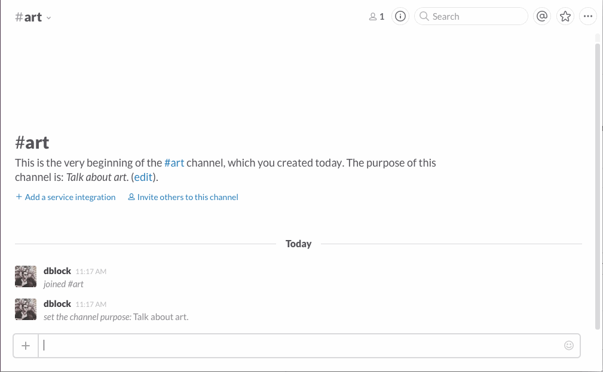

SlackGoogleBot
==============

A Slack bot for Google Search. Artsy uses this to search Artsy on Slack, using our [Google Custom Search Engine](https://google.com/cse).

## Installation

See [DEPLOYMENT](DEPLOYMENT.md).

## Commands

### google

Tell me about this bot.

### google [expression]

Search for _expression_.

## Contributing

See [CONTRIBUTING](CONTRIBUTING.md).

## Copyright and License

Copyright (c) 2015, Daniel Doubrovkine, Artsy and [Contributors](CHANGELOG.md).

This project is licensed under the [MIT License](LICENSE.md).
